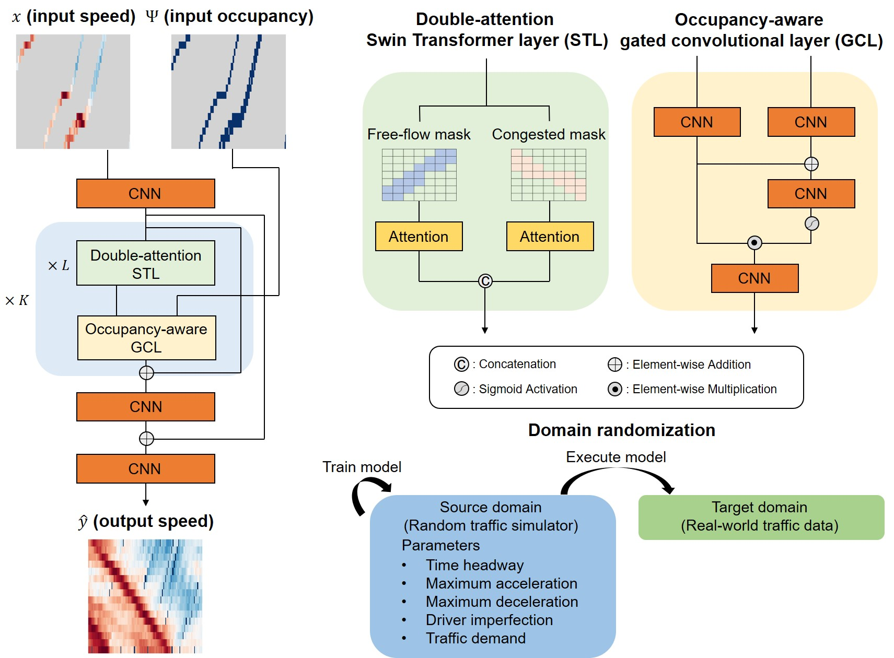

# DA-SwinTSE

[](https://www.python.org/) [](https://github.com/cho-96/SwinTSE/blob/main/LICENSE) [](https://github.com/cho-96/DA-SwinTSE)

**DA-SwinTSE** is a novel Traffic State Estimation (TSE) framework specifically engineered for unmonitored highway segments. Built upon a double-attention Swin Transformer and occupancy-aware gated convolutional layers, the model effectively captures long-range spatiotemporal dependencies while eliminating border artifacts. The double-attention mechanism meticulously constrains the attention mask to free-flow and congested propagation zones, strictly adhering to kinematic wave theory. To handle data sparsity, gated convolutional layers dynamically filter invalid or unobserved pixels in sensor-undetected regions, while the occupancy-aware architecture explicitly models sensor-occupied cells to accommodate dynamic probe vehicle measurements. By being trained exclusively on simulated data via domain randomization, DA-SwinTSE learns fundamental traffic dynamics, significantly enhancing its sim-to-real generalization capabilities.



## Features

1. **Model Train**: Trains the DA-SwinTSE model on simulated traffic data using traffic state matrices as both input and output.
2. **Model Test**: Evaluates model performance on real-world benchmarks using the same input–output format as the training dataset.

## Installation

1. **Create and activate a Python virtual environment** (Python >= 3.8 and <= 3.12), e.g., using [Miniconda3](https://www.anaconda.com/docs/getting-started/miniconda/install):

    ```bash
    conda create -n DA-SwinTSE python=3.8 -y
    conda activate DA-SwinTSE
    ```

    or using [venv](https://docs.python.org/3/library/venv.html):

    ```bash
    python3.8 -m venv .venv
    source .venv/bin/activate  # On Windows, use `.venv\Scripts\activate`
    ```

2. **Clone or fork the repository**:

    ```bash
    git clone https://github.com/cho-96/DA-SwinTSE.git
    cd DA-SwinTSE
    ```

3. **Install dependencies** from `requirements.txt`:

    ```bash
    pip install -r requirements.txt
    ```


## Model Train and Test Example


#### Example 1: Train the DA-SwinTSE model

```bash
python train.py --folder_path path/to/data/ --data name --model_path path/to/model/
```

#### Example 2: Test the DA-SwinTSE model

```bash
python test.py --folder_path path/to/data/ --data name --config config --model_path path/to/model/ --model_name model_name
```


<details>
<summary><b>📁 Input and Output Formats</b></summary>
Suppose the input and output files are named `input_train.npy` and `output_train.npy`:

- **Data shape and meaning**:  
  Each file stores a **spatial–temporal traffic state matrix** of size **n × 200**, where:  
  - **n** = spatial cells along the road segment (spatial cell size = n)  
  - **200** = consecutive time steps (temporal cell size = 200)  
  Each cell contains the **normalized average speed** of vehicles in that spatial–temporal bin.

- **Sparse sensor coverage in `input_train.npy`**:  
  For regions with partial sensor coverage, speed values are populated only at the corresponding spatial indices. All other cells representing unobserved areas are zero-padded to denote missing observations.

- **input_train.npy**: Matrix of normalized average speeds for the sensor-detected region (zeros elsewhere, as described above).  

- **output_train.npy**: Ground-truth matrix of normalized average speeds for the full spatial coverage.

</details>

## Citation

If you use **DA-SwinTSE** in your research, software, or to generate datasets, please cite the following resources appropriately:

1. **Repository Citation:** If you reference, modify, or build upon the DA-SwinTSE software itself, please also cite the corresponding github release:

    ```bibtex
    @software{cho2025daswintse,
      author = {Haechan, Cho},
      license = {MIT},
      month = december,
      title = { A double-attention Swin Transformer with occupancy-aware gated convolution and domain randomization for highway traffic state estimation },
      url = {https://github.com/cho-96/DA-SwinTSE},
      year = {2025}
    }
    ```

## Contributions

Contributions from the community are welcome! If you encounter any issues or have suggestions for improvements, please open a [GitHub Issue](https://github.com/cho-96/DA-SwinTSE/issues) or submit a pull request.

## License

This project is distributed under the MIT License. See the [LICENSE](LICENSE) file for more details.