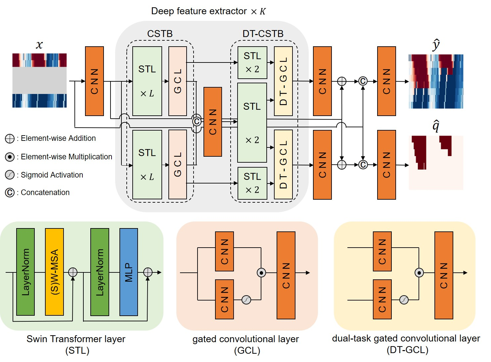

# DT-SwinTSE

[](https://www.python.org/) [](https://github.com/cho-96/SwinTSE/blob/main/LICENSE) [](https://github.com/cho-96/SwinTSE)

**DT-SwinTSE** is a novel traffic state estimation (TSE) framework designed for camera-undetected areas in urban arterials, built upon Swin Transformer and gated convolutional layers. DT-SwinTSE jointly estimates traffic speed maps and queue profile maps within a unified architecture, allowing urban queue dynamics to be explicitly incorporated into the TSE process. The Swin Transformer layers effectively capture long-range spatiotemporal dependencies without introducing border artifacts, while the gated convolutional layers dynamically filter invalid or unobserved pixels in camera-undetected regions throughout the network. The model is trained exclusively on simulated traffic data generated under diverse traffic conditions, enabling DT-SwinTSE to learn essential traffic dynamics while alleviating the data scarcity and noise commonly present in real-world datasets.



## Features

1. **Model Train**: Trains the DT-SwinTSE model on simulated traffic data using traffic state matrices as both input and output.
2. **Model Test**: Evaluates model performance on real-world benchmarks using the same input–output format as the training dataset.

## Installation

1. **Create and activate a Python virtual environment** (Python >= 3.8 and <= 3.12), e.g., using [Miniconda3](https://www.anaconda.com/docs/getting-started/miniconda/install):

    ```bash
    conda create -n DT-SwinTSE python=3.8 -y
    conda activate DT-SwinTSE
    ```

    or using [venv](https://docs.python.org/3/library/venv.html):

    ```bash
    python3.8 -m venv .venv
    source .venv/bin/activate  # On Windows, use `.venv\Scripts\activate`
    ```

2. **Clone or fork the repository**:

    ```bash
    git clone https://github.com/cho-96/DT-SwinTSE.git
    cd SwinTSE
    ```

3. **Install dependencies** from `requirements.txt`:

    ```bash
    pip install -r requirements.txt
    ```


## Model Train and Test Example


#### Example 1: Train the DT-SwinTSE model

```bash
python train.py --folder_path path/to/data/ --data name --model_path path/to/model/
```

#### Example 2: Test the DT-SwinTSE model

```bash
python test.py --folder_path path/to/data/ --data name --model_path path/to/model/ --model_name model_name
```


<details>
<summary><b>📁 Input and Output Formats</b></summary>
Suppose the input and output files are named `input_train.npy` and `output_train.npy`:

- **Data shape and meaning**:  
  Each file stores a **spatial–temporal traffic state matrix** of size **8 × 200**, where:  
  - **8** = spatial cells along the road segment (spatial cell size = 8)  
  - **200** = consecutive time steps (temporal cell size = 200)  
  Each cell contains the **normalized average speed** of vehicles in that spatial–temporal bin.

- **Camera coverage in `input_train.npy`**:  
  If the camera covers only 2 spatial rows, only those rows contain speed values, and all other rows are filled with zeros to indicate missing observations.

- **input_train.npy**: Matrix of normalized average speeds for the camera covered region (zeros elsewhere, as described above).  

- **output_train.npy**: Ground-truth matrix of normalized average speeds for the full spatial coverage.

</details>

## Citation

If you use **DT-SwinTSE** in your research, software, or to generate datasets, please cite the following resources appropriately:

1. **Repository Citation:** If you reference, modify, or build upon the SwinTSE software itself, please also cite the corresponding github release:

    ```bibtex
    @software{cho2025swintse,
      author = {Haechan, Cho},
      license = {MIT},
      month = december,
      title = { Dual-Task Urban Traffic State Estimation in Camera Undetected Area Using Swin Transformer and Gated Convolution },
      url = {https://github.com/cho-96/DT-SwinTSE},
      year = {2025}
    }
    ```

## Contributions

Contributions from the community are welcome! If you encounter any issues or have suggestions for improvements, please open a [GitHub Issue](https://github.com/cho-96/DT-SwinTSE/issues) or submit a pull request.

## License

This project is distributed under the MIT License. See the [LICENSE](LICENSE) file for more details.